  

# About Me:
Hi! I'm Rehan Nasywa Ramadhan, an aspiring tech enthusiast currently exploring full-stack development, cybersecurity, and robotics. I love tinkering with everything from interactive web applications to binary analysis and hands-on hardware prototyping. Still learning, constantly building, and always excited to bridge the gap between software, security, and smart machines.

  

###

<h3 data-importer="text" align="left">Tech Stacks</h3>

###

  
  
  
  
  
  
  
  
  
  
  
  
  
  
  
  
  
  
  
  
  
  
  

###

<h3 data-importer="text" align="left">Tech Stacks</h3>

###

  
  
  
  
  
  
  
  
  
  
  

###

<h3 data-importer="text" align="left">Tools</h3>

###

  
  
  

###
